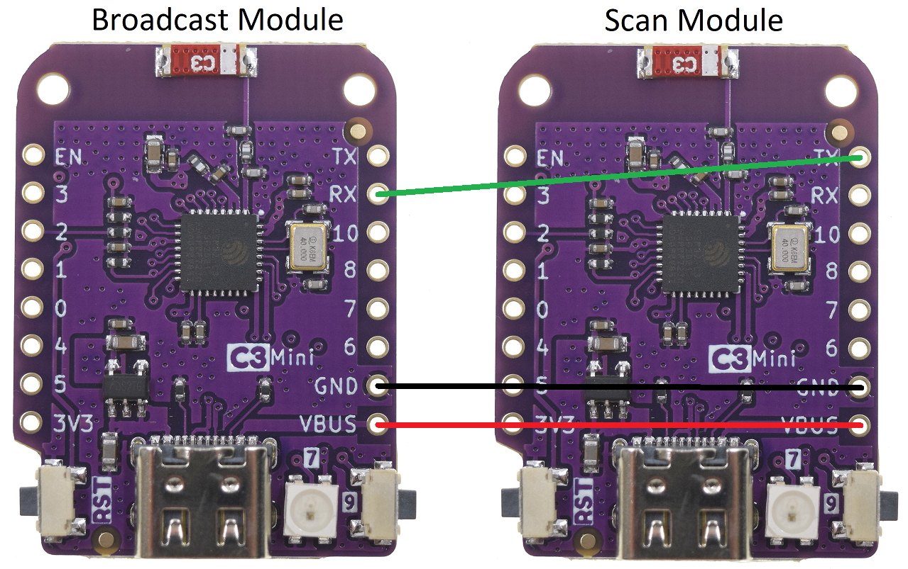

# BLE Timing System
A timing system for races. Based on ESP32. Uses Bluetooth Low Energy (BLE).

## How to use?
* Connect a 5V power supply to the ground station USB and position it in the finish gate.
* Connect 5V to the beacon module (voltage can be drawn from the flight controller or using [this BEC](https://s.click.aliexpress.com/e/_DddLQzr) connected to the LiPo battery balance).
* Tap with the beacon on the ground station.
* Start racing!

## Features:
* **Easy to use**: Plug and Play. No soldering is needed. Unplug when not needed.
* **Pass-By Detection**: The ground station scans for beacons and counts a lap using various algorithms. You can choose the algorithm that suits your needs.
* **Real Time Race Info on your smartphone**: The ground station is also an access point with a webpage. In the webpage, you have access to all the relevant race information of each competitor.
* **Easy editing**: in the webpage you can change each beacon name, and also reset and delete competitors.
* **LED lights**: The ground station outputs PWM signal proportional to the beacon's RSSI that is being detected at the moment.
* **Each beacon is unique**: the beacons identifier is its MAC Address. This mean that even though you flash the same hex file to all your beacons- they will all be distinguished.
* **Variable Power Level**:: the module on the drone can be accessed using bluetooth and its power level can be changed.

## View/Edit Race Info
To view and edit the race results:
1. Connect to the broadcast module Access Point using WiFi:
- SSID: BreakingCarbon
- Password: n3v3rdisarm
2. Open your browser and visit 192.168.1.1.
- If it doesn't work, you might want to disable mobile data.
3. The race results and other information will be displayed on the webpage. You can view and edit the details as needed.

## Lap Count Algorithms
The scan module sends RSSI measurements of each beacon to the broadcast module, which then processes the data and displays the results on the webpage. The system offers three different algorithms for calculating lap counts:
- **CLOSEST**: This algorithm identifies the lap by selecting the timestamp at which the drone had the strongest RSSI signal, indicating it was closest to the gate.
- **FIRST**: This algorithm determines the lap by choosing the first timestamp at which the drone was detected by the gate, regardless of the signal strength.
- **QUADRATIC**: This algorithm fits a quadratic curve to the RSSI data, and identifies the lap by selecting the timestamp corresponding to the peak of the curve, which represents the drone's closest point to the gate.

## Installation
TBA

## Hardware
- *Beacon*: Seeed Studio XIAO ESP32C3: 5-8 USD.
- *Ground station*: WEMOS LOLIN ESP32-C3 mini: 4 USD.

## Ground Station Wiring Diagram

